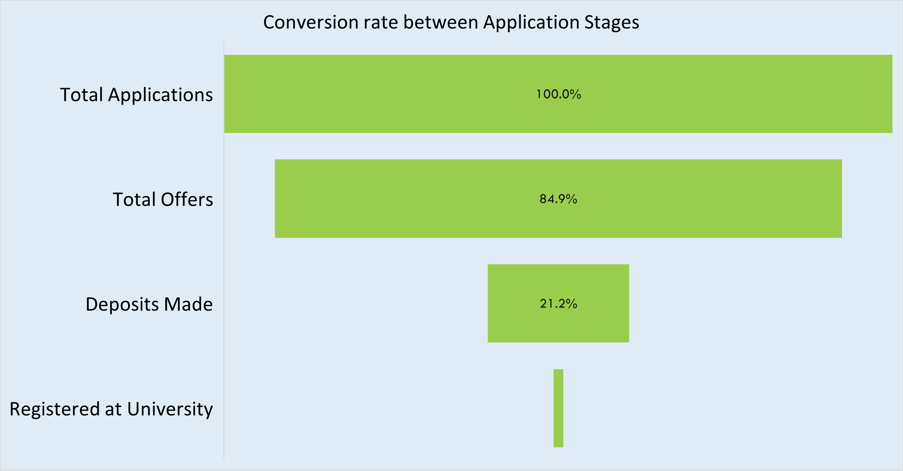
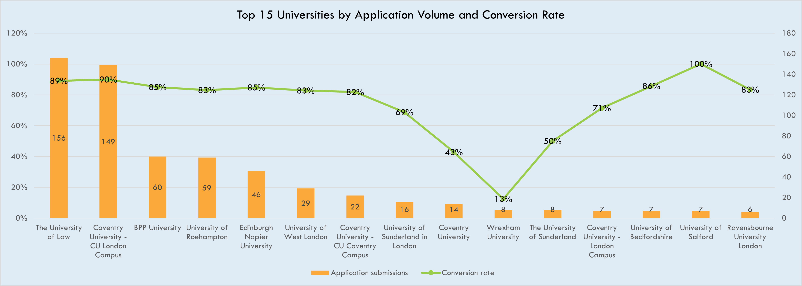

# Student Recruitment Funnel Insights (Excel)
Excel-based admissions funnel analysis: conversion rates, time-to-convert, and bottlenecks

## Project Overview
This project demonstrates an end-to-end admissions funnel analysis using Excel. The dataset (600+ student records across multiple funnel stages) captures applications submitted to universities, offers received, deposits made, and registrations. The goal was to analyse student progression through the funnel, identify bottlenecks, measure conversion performance, and recommend actionable strategies to improve outcomes.

The work was structured into three deliverables:

- Summary (high-level KPIs, insights, recommendations)

- Dashboards (Excel visuals for funnel, conversion, partner/university performance)

- Raw Data (cleaned and structured source data for reproducibility)

## Objectives
- Perform a funnel analysis to measure student movement from Application → Offer → Deposit → Registration.

- Evaluate partner and university performance, identifying top performers and those with low conversion rates.

- Pinpoint bottlenecks where most students drop off.

- Calculate time-to-convert between funnel stages (application to offer, offer to deposit, etc.).

- Analyse deposit dependency and willingness as predictors of conversion success.

- Generate data-driven recommendations for improving student conversion and cycle efficiency.

## Approach & Methodology
Data Preparation:
- Cleaned/validated dates; standardized stage labels.
- Added helper columns to compute days between stages:
App → Offer, Offer → Deposit (and used for cycle-time KPIs).
- Added encoded (0/1) stage flags for: Application Submitted, Offer Received, Deposit Made, Registered; used for pivots and funnel math.

## Metric logic
- Stage counts: distinct students at each highest achieved stage.

- Conversion rates:
App → Offer = Offers / Applications
Offer → Deposit = Deposits / Offers
Deposit → Registration = Registrations / Deposits

- Top-15 lists: ranked by applications (for volume context) and shown with conversion overlays.

- Time-to-convert: average days between Application Date → Offer Date and Offer Date → Deposit Date.

- Bottleneck analysis: segmented by Deposit Willingness and Deposit Dependency; grouped common blockers surfaced in KAM remarks (e.g., Interview to be given, Other conditions, Updated offer letter, Arranging funds, Loan).

## Key Insights (from the dashboards)
Overall funnel:
- App → Offer is strong at 84.9%.
- Offer → Deposit is weak at 21.2% (major leakage).
- Registration after deposit is very low (tiny tail vs deposits on the funnel chart).
Interpretation: healthy application and offer phases; post-offer follow-through is the main gap.

  

Time to convert:
- Application → Offer: ~10.4 days (reasonable).
- Offer → Deposit: ~45.3 days (long; risk window where momentum is lost).

  

University performance (volume + conversion)
- High-volume, high-conversion:
- The University of Law (156 apps, ~89% App→Offer)
- CU London Campus (149 apps, ~90%)

Low-yield outliers despite volume:
- Coventry University (~43%)
- Wrexham University (~13%)

Partner (agent) performance:
- Top performers (e.g., Partner 37, 24, 21) combine high offer rates (≈80–100%) with solid deposit rates, and meaningful volumes.

- Low performers (e.g., Partner 29, 19, 40) show good offers but poor deposit conversion and/or thin volumes—indicative of weak post-offer follow-up, financing hurdles, or documentation delays.

Bottlenecks (by willingness & dependency):
- Major stalls after offer concentrated in:
- “Interview to be given” — ~43 students stuck at Offer stage (Willingness = No cluster).
- “Other conditions” — ~21 stuck at Offer; plus ~10 still at Submitted.
- “Loan / Arranging funds / Updated offer letter” — repeated blockers with double-digit counts at Offer stage.
Pattern: Willingness = No/Maybe and Loan/Funds dependency correlate with stalling post-offer.

## Dashboard Preview

  

## Recommendations (targeted, data-driven)
1. Attack the Offer → Deposit gap (21.2%)
- Create a 30-day SLA from Offer to Deposit; weekly exception list to KAMs and partner leads.
- Auto-nudge sequences for offer holders (D0/D3/D7/D14), escalating to calls for D21+.

2. Condition-clearance sprints
- Run weekly “condition clinics” with universities to resolve Interview to be given / Other conditions / Updated offer letter cases.
- Dashboard a condition-aging view; any case >14 days gets flagged.

3. Financial readiness lane for loan/fund-dependent students
- Early finance counseling and pre-approval guidance; curated NBFC/scholarship options.
- Separate pipeline for Loan/Funds dependency with tighter follow-ups until proof of funds.

4. Partner enablement & accountability
- Share playbooks from Partner 37/24/21: pre-offer document checks, fast outreach cadence, deposit scripts.
- For Partner 29/19/40, set offer-to-deposit cadence targets, weekly reviews, and access to the finance lane above.

5. University mix optimization
- Prioritize high-yield universities (U. of Law, CU London Campus).
- For Coventry/Wrexham tracks, align on clearer admission criteria and condition timelines—or deprioritize until SLAs improve.

6. Reduce cycle time to protect intent
- Keep App→Offer ≈10 days; focus ops on cutting Offer→Deposit from ~45 days to ≤30 days.
- Add “hot lead” fast-track: high-willingness students get same-day outreach and deposit support.

## Deliverables in this repo
- Excel: student_funnel_analysis.xlsx
- Summary (KPIs, insights & actions)
- Dashboards (Funnel, University/Partner views, Bottlenecks, Cycle time)
- Raw Data (with derived day-diff and stage-flag columns)
- Screenshots: in /assets
- README: this document
